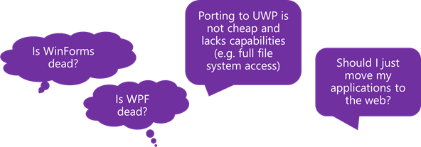
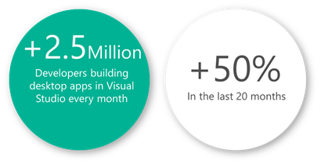
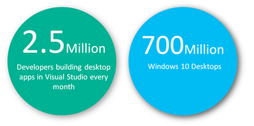

## Desktop Applications past, present & future

In 2002, the first version of the .NET Framework was released. At around the same time, Windows Form Applications (known as WinForm applications) was introduced together with the new Visual Studio IDE. Web application development was rising swiftly, but Internet Explorer and Netscape (the two leading browsers of that time) didn’t support much client functionality, besides that, the client code produced by developers was in many cases not compatible between both browsers.
This scenario meant that while the functionality of the browsers was being improved, the preferred option for many organizations was the creation of desktop applications, even if those applications had complex UI requirements.
Before .NET Framework, Visual Basic applications extended it's capabilities with distributed architectures using DCOM (Distributed Component Object Model) or Microsoft Transaction Server. WinForms received several improvements in subsequent versions of .NET Framework. Microsoft introduced .NET 3.0 in 2006, which included the Windows Presentation Foundation (WPF). WPF took a different approach, it separated the behavior of a user interface control from the way it looked. At that time, this was revolutionary, and it gave developers and organizations the possibility to include new patterns like MVVM (Model-View-ViewModel) architecture.

## .NET Core 3 the future for Desktop Applications

The launch of .NET Core in July 2016 with ASP.NET support, created a buzz within developers and organizations, and the anticipation was Microsoft would announce the discontinuation of support for WinForm and WPF based desktop applications.

Until December 2018, when Microsoft announced the support for WinForm and WPF in .NET Core 3.

The ecosystem of developers, using Windows Forms and WPF to develop desktop based applications is healthy and growing. Organizations and developers welcomed the support announcement in .NET Core 3 for WinForms and WPF with both hands.

Also, the Windows 10 desktop market is increasing and, nearly every enterprise has started transitioning to Windows 10 or has a planned date for upgrades.

