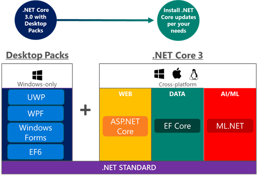

# .NET Core 3 Windows Form and WPF support

.NET Core 3 is a significant update, which adds support for building Windows desktop applications using Windows Presentation Foundation (WPF), Windows Forms, Entity Framework 6 (EF6), and upgrading from version 2.x to 3.0.

The support for Windows Desktop application development is one of the leading news presented by this update; this will allow Windows developers the possibility of developing applications for WPF, WinForms, and UWP, under an open source platform.




## Windows desktop support in .NET Core 3

> Support for Windows desktop, primarily as a set of "Windows Desktop Packs," works only on Windows. This component is part of the Windows version of the SDK.

WPF and Windows Forms are layers over Windows techonologies like DirectX and GDI Plus; that exposes the desktop application functionality. It is the C# code in Windows Forms and WPF that is included as a set of libraries with .NET Core 3.  

C#, F# and VB already work with .NET Core 2.0. You will be able to build desktop applications with any of those three languages with .NET Core 3.

## Considerations about Compatibility

### Universal Windows Applications (UWP)

UWP unifies the family of Windows devices, from PC to tablets, phablets, phones, and XBOX. It also includes the new Internet of Things (IoT) devices without a head. UWP offers many excellent features, such as an app store that allows you to monetize your applications more efficiently. And the Windows Runtime (WinRT) provides API operating systems much more usable but completely native and robust integration, such as the composition of XAML and DirectX.
If you are targeting Windows 8 or Windows Phone 8.1, you are ready; these are .NET Core applications.
If you have Windows Phone Silverlight applications, you're pretty close. Any Silverlight application should be the right candidate because the API set is based mostly on what was available in Silverlight. Most APIs are available in .NET Core or became WinRT APIs, and they only need a touch-up or sometimes just a change of the namespace.

### Windows Forms and WPF

Starting with .NET Core 3.0 Preview 1, you can build Windows desktop applications using WPF and Windows Forms. These frameworks also support using modern controls and Fluent styling from the Windows UI XAML Library (WinUI) via [XAML islands](/windows/uwp/xaml-platform/xaml-host-controls).

### Fluent styling from the Windows UI XAML Library (WinUI) via XAML Islands

Windows 10 now enables you to use UWP controls in non-UWP desktop applications. So you can improve the look, feel and functionality of your existing desktop applications with the latest Windows 10 user interface features that are only available through the UWP controls. This means that you can use UWP functions, such as Windows Ink and controls that support the Fluent Design System in your existing WPF, Windows Forms and C ++ Win32 applications. This developer scenario is sometimes called XAML islands.

### Creating WPF and Windows Forms projects

You can create a new WPF or Windows Forms app with the following `dotnet` commands:

```console
dotnet new wpf
dotnet new winforms
```

Visual Studio 2019 adds **New Project** templates for .NET Core 3.0 Windows Forms and WPF. You can open, launch, and debug these projects in Visual Studio 2019.

> Designers are yet to be supported

The new projects are the same as existing .NET Core projects, with a couple additions. Here is the comparison of the underlying .NET Core console project and a basic Windows Forms and WPF project.

In a .NET Core console project, the project uses the `Microsoft.NET.Sdk` SDK and declares a dependency on .NET Core 3.0 via the `netcoreapp3.0` target framework. To create a Windows Desktop app, use the `Microsoft.NET.Sdk.WindowsDesktop` SDK and choose which UI framework to use:

```diff
-<Project Sdk="Microsoft.NET.Sdk">
+<Project Sdk="Microsoft.NET.Sdk.WindowsDesktop">
  <PropertyGroup>
    <OutputType>Exe</OutputType>
    <TargetFramework>netcoreapp3.0</TargetFramework>
+   <UseWPF>true</UseWPF>
  </PropertyGroup>
</Project>
```

To choose Windows Forms over WPF, set `UseWindowsForms` instead of `UseWPF`:

```diff
<Project Sdk="Microsoft.NET.Sdk.WindowsDesktop">
  <PropertyGroup>
    <OutputType>Exe</OutputType>
    <TargetFramework>netcoreapp3.0</TargetFramework>
-   <UseWPF>true</UseWPF>
+   <UseWindowsForms>true</UseWindowsForms>
  </PropertyGroup>
</Project>
```

Both `UseWPF` and `UseWindowsForms` can be set to `true` if the app uses both frameworks, for example a Windows Forms dialog is hosting a WPF control.

## MSIX Deployment for Windows Desktop

[MSIX](https://docs.microsoft.com/windows/msix/) is a new Windows app package format. It can be used to deploy .NET Core 3.0 desktop applications to Windows 10.

The [Windows Application Packaging Project](https://docs.microsoft.com/windows/uwp/porting/desktop-to-uwp-packaging-dot-net), available in Visual Studio 2019 Preview 2, allows you to create MSIX packages with [self-contained](../deploying/index.md#self-contained-deployments-scd) .NET Core applications.

> Note: The .NET Core project file must specify the supported runtimes in the `<RuntimeIdentifiers>` property:
```xml
<RuntimeIdentifiers>win-x86;win-x64</RuntimeIdentifiers>
```

## Fast built-in JSON support

The .NET ecosystem has relied on [**Json.NET**](https://www.newtonsoft.com/json) and other popular JSON libraries, which continues to be good choices. **Json.NET** uses .NET strings as its base datatype, which are UTF-16 under the hood.

The new built-in JSON support is high-performance, low allocation, and based on `Span<byte>`. Three new main JSON-related types have been added to .NET Core 3.0 `System.Text.Json` namespace.

### WinRT

WinRT offers a native XAML-based UI technology that is very similar to Silverlight and WPF.
So if you were planning to redesign your application to be usable across various form factors, this shouldn’t be a blocker for you.

## Missing features

* WPF for .NET Core doesn't support the XAML Designer. If you want to use the XAML Designer, you will need to do that in the context of a .NET Framework project, e.g. by linking your .NET Core source files into a .NET Framework project.
* You can see examples of how to do this in the [WPF Samples repo](https://github.com/Microsoft/WPF-Samples).
* [XAML Browser applications (XBAPs)](https://docs.microsoft.com/en-us/dotnet/framework/wpf/app-development/wpf-xaml-browser-applications-overview) are not supported for .NET Core 3. 
* Not all .NET Framework features are supported for .NET Core 3. You can use the [.NET API Portability Analyzer](https://github.com/microsoft/dotnet-apiport) to see if your existing code can run on .NET Core 3.

## Not supported technologies

There are some technologies not supported in .NET Core. We will discuss this in more details in subsequent sections:

* App Domains 
* Remoting
* Binary serialization
* Sandboxing

## Other general new features relevant for desktop applications

.NET Core 3 includes new exciting features besides Windows Desktop support, here's a brief list:

 - Entity Framework 6 (EF6)
 - EF Core 3 support Azure Cosmos DB
 - New fast in-box JSON Reader 


## Default Executables

.NET Core will now create framework-dependent executables by default. This is new for applications that use a globally installed version of .NET Core. Until now, only autonomous implementations would produce an executable.

During dotnet build or dotnet publish, the executable is created provided that matches the environment and platform of the SDK you are using. You can expect the same things with these executables as you would with other native executables, such as:

    You can double-click on the executable.
    You can launch the application from a command prompt directly, such as myapp.exe on Windows, and ./myapp on Linux and macOS.

## Build copies dependencies

.NET Core 3 build now copies NuGet dependencies for your application from the NuGet cache to the build output folder. Previously, dependencies were only copied as part of dotnet publish.

> There are some operations, like linking and razor page publishing that will still require publishing

## Local dotnet tools

Though .NET Core 2.1 supported global tools, .NET Core 3.0 now has local tools.
Local tools are similar to global tools but are associated with a particular location on disk.
This enables per-project and per-repository tooling. Any tool installed locally isn't available globally.

> Tools are distributed as NuGet packages

Local tools rely on a manifest file name dotnet-tools.json in your current directory.
This manifest file defines the tools that will be available in that folder and below.

By creating this manifest file at the root of your repository, you ensure anyone cloning your code can restore and use the tools that are needed to successfully work with your code.


