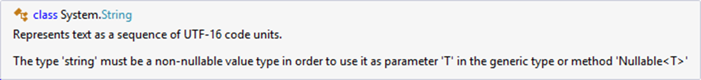
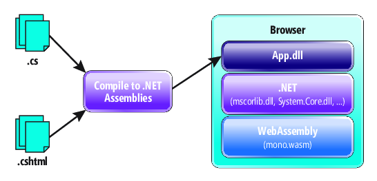
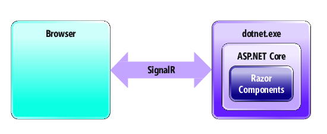

# Other new features of .NET Core 3

.NET Core 3 es una gran actualización que añade soporte más allá del desarrollo de aplicaciones Windows escritorio con WPF y Winforms. 
Nuevas caracteristicas con ASP.NET Core 3 permitiendo el desarrollo del lado cliente con componentes Razor,  EF Core 3 para Azure Cosmos Db, soporte para la nueva versión C# 8.0 y una larga lista. Comentaremos alguna de ellas.

## C# 8.0 

C# 8.0 ha sido construido con .Net Core 3.0 y .NET Standard 2.1. Por lo tanto muchas de sus características solamente funcionán bajo estas versiones y no será soportado fuera de .NET Core 3.0 y cualquier plataforma que implemente .NET Standard 2.1

Las novedades más importantes que se incorporan en la nueva versión de C# son las siguientes.

### Nullable reference types
The nullable reference types feature intends to warn you about null-unsafe behavior in the code. Since we didn’t do that before, it would be a breaking change to just start now! To avoid that, you need to opt in to the feature.

El propósito de esta nueva característica es ayudar con la gestión de valores `null` en nuestras variables mediante warnings y fomentar una programación null-safe marcando los los tipos de referencia, p.ej: `string` o cualquier otra clase, como nulables haciendo uso del ya conocido símbolo de interrogación `?`.

Si ejecutamos este código sobre C#7.0 obtendríamos un error en tiempo de ejecución:

```csharp
using static System.Console;
class Program
{
    static void Main(string[] args)
    {
        string s = null;
        WriteLine($"The first letter of {s} is {s[0]}"); // NullReferenceException here
    }
}
```
Si intentamos nular el tipo string con `string? s= null` el editor avisa de que solo puedes nular tipos que sean non-nullable, y `string` es uno de ellos. 

 

Ahora en C# 8.0 con el código de arriba obtendríamos un warning en la línea que en tiempo de ejecución nos estaba fallando.
Y ahora **podemos marcar los tipos nulables** y que el compilador sepa dónde hacemos uso de ellos, mostrándonos un warning en el caso de no validar correctamente el valor null.

Y el código anterior con C# 8.0 nos quedaría así:

```csharp
using static System.Console;
class Program
{
    static void Main(string[] args)
    {
        string? s = null;
        WriteLine($"The first letter of {s} is {s[0] ?? 'null' }");
    }
}
```

### Async Streams

Se incorporan secuencias para facilitar el flujo de iteraciones de forma asíncrona en casos donde queremos leer datos sin bloquear la ejecución de un proceso. 

```csharp
static async Task Main(string[] args)
{
    Console.WriteLine($"{DateTime.Now.ToString()} => Start ");

    foreach(var data in await GetBigResultsAsync())
    {
        Console.WriteLine($"{DateTime.Now.ToString()} => {data}");
    }
 
    Console.ReadLine();
}
 
static async Task<IEnumerable<int>> GetBigResultsAsync()
{
    List<int> data = new List<int>();
    for (int i = 1; i <= 10; i++)
    {
        await Task.Delay(1000); //Simulate waiting for external API
        data.Add(i);
    }
 
    return data;
}
```

En el código de arriba el método *GetBigResultsAsync()* simula que tarda 1 segundo en obtener un dato numérico. 
Iterando 10 veces tardaremos 10 segundos en devolver todos los datos en nuestra lista y nuestra salida por pantalla sería:
```
01/04/2019 13:34:00 => Start
01/04/2019 13:34:10 => 1
01/04/2019 13:34:10 => 2
01/04/2019 13:34:10 => 3
01/04/2019 13:34:10 => 4
01/04/2019 13:34:10 => 5
01/04/2019 13:34:10 => 6
01/04/2019 13:34:10 => 7
01/04/2019 13:34:10 => 8
01/04/2019 13:34:10 => 9
01/04/2019 13:34:10 => 10
```
Lo que sucede es que desde el primer segundo ya tenemos un dato que puede ser procesado sin tener que esperar a obtener los 9 restantes y esperar esos segundos para imprimirlos por pantalla. Problema, estamos desaprovechando tiempo de procesado.
Tal y como está escrito el código su ejecución es en bloque y no es posible utilizar `yield` para devolver cada dato. 

Ahora con Async Streams tenemos `IAsyncEnumerable` y  `await foreach` para ayudar a transformar el código dejándolo:

```csharp
static async Task Main(string[] args)
{
    Console.WriteLine($"{DateTime.Now.ToString()} => Start ");

    await foreach(var data in GetBigResultsAsync())
    {
        Console.WriteLine($"{DateTime.Now.ToString()} => {data}"); //Processing data
    }
 
    Console.ReadLine();
}
 
static async IAsyncEnumerable<int> GetBigResultsAsync()
{
    for (int i = 1; i <= 10; i++)
    {
        await Task.Delay(1000); //Simulate waiting for external API
        yield return i;
    }
}
```

Ahora sí es posible utilizar la palabra clave `yield` para devolver los datos y aprovechar cata iteración para procesarlos por cada segundo.
```
01/04/2019 13:35:00 => Start
01/04/2019 13:35:00 => 1
01/04/2019 13:35:01 => 2
01/04/2019 13:35:02 => 3
01/04/2019 13:35:03 => 4
01/04/2019 13:35:04 => 5
01/04/2019 13:35:05 => 6
01/04/2019 13:35:06 => 7
01/04/2019 13:35:07 => 8
01/04/2019 13:35:08 => 9
01/04/2019 13:35:09 => 10
```

### Range and Index
Los tipos Range e Index se centran en interactuar con listas o arrays de una forma más sencilla.
Se aplican sobre un array o cualquier objeto que cumpla con la interfaz `IEnumerator`. Se declaran entre corchetes con los índices de inicio y fin separados por dos puntos. El índice contiene el valor que nos indica la posición del array a delimitar.

Sin usar LINQ recogeremos una porción de este array usando los índices y rangos. 

Con el código de ejemplo:
```csharp
var people = new string[] {
    "David", "Leonardo", "Fernando", "Miguel", 
    "Leia", "Rodrigo", "Thais", "Esther"
};   
foreach (var p in people[0..3]) Console.Write($"{p}, ");    // David, Leonardo, Fernando, Miguel, 
foreach (var p in people[0..^5]) Console.Write($"{p}, ");   // David, Leonardo, Fernando, Miguel, 
foreach (var p in people[^4]) Console.Write($"{p}, ");      // Leia, Rodrigo, Thais, Esther, 
foreach (var p in people[6..]) Console.Write($"{p}, ");     // Thais, Esther, 
foreach (var p in people[..]) Console.Write($"{p}, ");      // David, Leonardo, Fernando, Miguel, Leia, Rodrigo, Thais, Esther,
```

Un índice es un número que indica la posición dentro de un conjunto de objetos. Si por ejemplo indicamos el índice `0` de people este será "David". 
Si indicamos `^1` será el último elemento de nuestra colección: "Esther". Por lo tanto, que un índice con el carácter `^` se resta al valor de Length de nuestro objeto.

Un rango es la tupla de un índice de inicio y un índice de fin separados por dos puntos: `0..^1`. Este ejemplo recogería los elementos desde el "David" hasta "Esther".

Observando el ejemplo sacamos las siguientes reglas para los índices:
- Puedo traerme un rango indicando la posición inicio y fin tal que `people[0..3]`
- Si quiero limitar por el final puedo omitir el índice de inicio tal que `people[..3]`
- Si quiero limitar por el principio también puedo decir que comience desde *Length - posición*, es decir `people[^4]`
- Si quiero limitar por el principio puedo omitir el índice final tal que `people[6..]`
- La ausencia de alguno de los índices en el rango se tomará como el inicio que delimita. Por lo tanto si omito el de inicio contará desde 0, si omito el de final tomará la última posición, lo que sería el `people.Length`.
- Puedo omitir cualquiera de los índices y el rango tendría todos los valores, siendo como el valor normal entonces: `people[..].Length == people.Length`


### Recursive patterns

Esta característica hace referencia a *Pattern Matching* muy presente en los lenguajes funcionales.

Con el siguiente código de ejemplo:
```csharp
class Student
{
    public string Name { get; set; }
    public bool Graduated { get; set; }
}
var people = new object[] {
    new Student(){Name = "David", Graduated= false},
    new Student(){Name = "Leonardo", Graduated= true},
    new Student(){Name = "Fernando", Graduated= false},
}
```

Sin usar LINQ nin ninguna otra referencia a librería externa, en versiones anteriores a C# 8.0 para obtener los nombres de los *Students* que están graduados haríamos por ejemplo un `foreach` con una condición `if` y obtendria el nombre de los objetos que cumpliesen la condición.

```csharp
IEnumerable<string> GetNameStudentsNotGraduated()
{
    foreach (var p in People)
    {
        if (p is Student && !p.Graduated)
        {
            string name = p.Name;
            yield return name;
        }
    }
}
```
Ahora en C# 8.0 lo podemos transformar hacia: 
```csharp
IEnumerable<string> GetNameStudentsNotGraduated()
{
    foreach (var p in People)
    {
        if (p is Student { Graduated: false, Name: string name }) 
            yield return name;
    }
}
```
La condición del `if` se simplifica sobre el filtrado de nuestro colección, obteniendo un codigo más semántico. Esta condición debe cumplir que sea un objeto de tipo `Student` y con `Graduated == false`. Además, la propiedad `Name` es asignada a una variable `string name` usada por `yield` en la devoución de los datos de la función.

### Switch expressions

Esta característica añade claridad semática a los bloques `switch`.

Ahora podremos olvidarnos del `case` y en su lugar poner la "condición" de varias maneras:
 - Puedo seguir usando mi palabra `when` como ya se podía en versiones anteriores a C# 8.0
 - Puedes usar *Pattern matching* visto en el punto anterior y no usar `when`
 - Puedes usar *Deconstruction Pattern* de un objeto
 - El cuerpo de cada función lo podemos expresar en una misma línea tras el `=>`, y también olvidarnos del `break;` al final. 

```csharp
class Point
{
    public int X { get; set; }
    public int Y { get; set; }
}
```

Ahora podemos hacer un bloque `switch` como el siguiente:

```csharp
return o switch
{
    Point p when p.X == 5 && p.Y == 5   => "Hight 5",   //no case
    Point { X: 0, Y: 0 }                => "origin",    //pattern matching
    Point { X: var x, Y: var y }        => $"{x}, {y}", //pattern matching
    Point(-5, -5)                       => "Low",       //Deconstruction Pattern
    Point(var x, var y)                 => $"{x}, {y}", //Deconstruction Pattern
    _                                   => "unknown"
};
```

Otro ejemplo donde tambien podemos calcular el area según el tipo de un objeto:
```csharp
var area = figure switch 
{
    Rectangle r => r.Width * r.Height,
    Circle c    => Math.PI * c.Radius * c.Radius,
    _           => 0
};
```

### Implicit constructors
 
Una simple característica para inferir el tipo del constructor:

```csharp
Person[] people =
{
    new ("Elena", 24, "Spain"),
    new ("David", 43, "France"),
    new ("Leonardo", 31, "Italy"),
    new ("Esther", 18, "United States"),
};
```

### More features in C# 8.0
- Using declaration
- Default interfaces
- `static` local functions: Local functions marked with `static` cannot reference `this` or variables in the enclosing functions
- Local functions and lambdas can now declare parameters and locals that shadow names of variables of the enclosing functions.
- Null-coalescing assignment: `x ??= y;` only assigns `y` to `x` if x was `null`.


## EF Core 3

El proyecto Entity Framework Core (EF Core) incluye mejoras y cambios en la API que necesiten una migración desde las aplicaciones con version la 2.2.x. 
A partir de la versión 3.0, el framework ASP.NET Core ya no incluirá ninguna referencia a EF Core ni a ningún proveedor de datos de EF, por lo que para hacer uso del mismo en una aplicación de ASP.NET Core 3.0 será necesario incluir una referencia de forma explícita. De esta manera tenemos el control de que versión de EF Core y librerías de proveedores queremos desplegar sin existir ningún acoplamiento obteniendo la misma experiencia de desarrollo en todas las aplicaciones .NET soportados.

Otra característica esperada es el soporte para Azure Cosmos DB. Permitir a los desarrolladores familiarizados con EF puedan crear aplicaciones con unas base de datos no-sql que tenga todas las ventajas de Azure Cosmos DB: distribución global, disponibilidad de "always on", escalabilidad... Las características conocidas de EF como el tracking changes, LINQ y los vaores de conversión será includios en esta versión.

La proxima versión de EF 6 será adaptada para que se ejecute sobre .NET Core 3 para facilitar la portabilidad de aplicaciones. Hoy en día muchas aplicaciones han uso de EF en versiones anteriores y la migración es muy costosa, por lo que esta nueva funcionalidad viene para ayudar en el trabajo, aunque tendrá algunas limitaciones. Como por ejemplo, será necesario nuevos proveedores de datos al margen de SQL Server que ya está soportado por .NET Core. Tampoco los datos espaciales tendrán soporte.

Mejoras en LINQ con el objetivo de generar consultas más robustas y con expresiones a SQL escritas de una forma más correcta. Detectar y evitar esas otras consultas más ineficientes que puedan pasarse por alto y llegar a producción.

Muchas mejoras esperadas que tendrán continuidad de desarrollo con NET Core 3.


## ASP.NET Core 3
.NET Core 3.0 is not all about the desktop. There are lots of exciting new features designed for the Web, as well. Let’s take a look at a few of the features on which we’re working.

A common question from customers is how to have an RPC (as in .NET Remoting and Windows Communication Foundation) experience on .NET Core. We are contributing to the gRPC (grpc.io) project to ensure gRPC will have first-class support for .NET developers.

Earlier this year we started an experiment in client-side Web development using .NET that we call Blazor. Blazor enables you to write Web UI components that run directly in the browser on a WebAssembly-based .NET runtime without writing a single line of JavaScript. You author components using Razor syntax, which are then compiled along with your code into normal .NET assemblies. The assemblies and the WebAssembly-based .NET runtime are then downloaded into the browser and executed using only open Web standards (no plug-ins or code transpilation required), as shown in Figure 1.


Figure 1 Client-Side Web Development with Blazor

Alternatively, the same components can be run on the server using .NET Core, where all UI interactions and DOM updates are handled over a SignalR connection, as shown in Figure 2. When the components execute, they track what updates are required to the DOM and send these updates to the browser over the SignalR connection to be applied. UI events are sent to the server using the same connection. This model has several advantages: The download size is much smaller, your code is centralized on the server, and you get all the features and performance benefits of running on .NET Core.


Figure 2 Running UI Web Components on the Server Using SignalR

For .NET Core 3.0 we’re integrating the Blazor component model into ASP.NET Core. We call this integrated component model Razor Components. Razor Components enable a new era of composable UIs with ASP.NET Core, and full-stack Web development with .NET. Initially for .NET Core 3.0, Razor Components will run on the server, either as standalone routable components or used from Razor Pages and Views. The same components, however, can also be run client side on WebAssembly. In parallel with the .NET Core 3.0 work, we’ll continue work on supporting Razor Components on WebAssembly using the interpreter-based .NET runtime, which we expect to ship in a subsequent release. Later, we also plan to release support for full ahead-of-time compilation of .NET code to WebAssembly, which will bring significant improvements to runtime performance.


## More features

 - System.Buffers.SequenceReader
 - Serial Port APIs now supported on Linux
 - GPIO, PWM, SPI and I2C APIs now available
 - Supporting TLS 1.3 and OpenSSL 1.1.1 now Supported on Linux
 - More BCL Improvements
 - Default implementations of interface members
 - Tiered Compilation
 - Assembly Metadata Reading with MetadataLoadContext
 - ARM64
 - Platform Support: OS list 
 
<!-- ### JSON Reader


>A brief mention that there are other new features that we are not covering in detail

 - HTTP Resiliency
 - Ranges and indices
 - ASP.NET Core 3
 - System.Buffers.SequenceReader
 - Serial Port APIs now supported on Linux
 - GPIO, PWM, SPI and I2C APIs now available
 - Supporting TLS 1.3 and OpenSSL 1.1.1 now Supported on Linux
 - More BCL Improvements
 - Default implementations of interface members
 - Tiered Compilation
 - Assembly Metadata Reading with MetadataLoadContext
 - ARM64
 - Platform Support: OS list 

https://devblogs.microsoft.com/dotnet/announcing-net-core-3-preview-1-and-open-sourcing-windows-desktop-frameworks/ 
https://visualstudiomagazine.com/articles/2019/01/30/net-core-3-preview-2.aspx 

JsonSerializer sustituye a la libreria Newtonsonft.Json
https://github.com/dotnet/corefx/issues/33115 -> futre json
https://github.com/dotnet/corefx/issues/35573 -> Breaking changes 3.0
aspnet core
EF Core cosmos -->