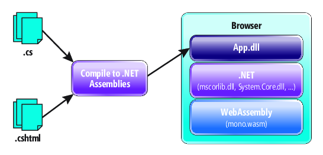

# Other new features of .NET Core 3

.NET Core 3 is a great upgrade that adds support beyond developing Windows desktop applications with WPF and Winforms. 
New features with ASP.NET Core 3 allowing client-side development with Razor components, EF Core 3 for Azure Cosmos Db, support for the new C# 8.0 version and a long list. We will comment on some of them.

## C# 8.0 

C# 8.0 has been built with .NET Core 3.0 and .NET Standard 2.1. Therefore many of its features will only work under these versions and will not be supported outside .NET Core 3.0 and any platform that implements .NET Standard 2.1.

The most important new features incorporated in the new version of C# are the following.

### Nullable reference types
The nullable reference types feature intends to warn you about null-unsafe behavior in the code. Since we didn't do that before, it would be a breaking change to just start now! To avoid that, you need to opt in to the feature.

The purpose of this new feature is to help with the management of `null` values in our variables through warnings and to encourage null-safe programming by marking the reference types, e.g. `string` or any other class, as nullable using the already known question mark `?`.

If we execute this code over C#7.0 we would get a runtime error:

```csharp
using static System.Console;
class Program
{
    static void Main(string[] args)
    {
        string s = null;
        WriteLine($"The first letter of {s} is {s[0]}"); // NullReferenceException here
    }
}
```
If we try to null the string type with `string? s= null` the editor warns that you can only null types that are non-nullable, and `string` is one of them. 

 

Now in C# 8.0 with the code above we would get a warning on the line that at runtime was failing us.
And now **we can mark the nullable types** and let the compiler know where we make use of them, showing us a warning in the case of not validating correctly the null value.

And the previous code with C# 8.0 would look like this:

```csharp
using static System.Console;
class Program
{
    static void Main(string[] args)
    {
        string? s = null;
        WriteLine($"The first letter of {s} is {s[0] ?? 'null' }");
    }
}
```

### Async Streams

Asynchronous sequences are incorporated to facilitate the flow of iterations asynchronously in cases where we want to read data without blocking the execution of a process. 

```csharp
static async Task Main(string[] args)
{
    Console.WriteLine($"{DateTime.Now.ToString()} => Start ");

    foreach(var data in await GetBigResultsAsync())
    {
        Console.WriteLine($"{DateTime.Now.ToString()} => {data}");
    }
 
    Console.ReadLine();
}
 
static async Task<IEnumerable<int>> GetBigResultsAsync()
{
    List<int> data = new List<int>();
    for (int i = 1; i <= 10; i++)
    {
        await Task.Delay(1000); //Simulate waiting for external API
        data.Add(i);
    }
 
    return data;
}
```

In the code above the *GetBigResultsAsync()* method simulates that it takes 1 second to get a numeric data. 
Iterating 10 times it will take 10 seconds to return all the data in our list and our screen output would be:
```
01/04/2019 13:34:00 => Start
01/04/2019 13:34:10 => 1
01/04/2019 13:34:10 => 2
01/04/2019 13:34:10 => 3
01/04/2019 13:34:10 => 4
01/04/2019 13:34:10 => 5
01/04/2019 13:34:10 => 6
01/04/2019 13:34:10 => 7
01/04/2019 13:34:10 => 8
01/04/2019 13:34:10 => 9
01/04/2019 13:34:10 => 10
```
It happens that from the first second we already have a value that can be processed without having to wait to get the remaining 9 values and wait those seconds to print them on screen. Problem, we are wasting processing time.
As it is written the code is executed in block and it is not possible to use `yield` to return each data. 

Now with Async Streams we have `IAsyncEnumerable` and `await foreach` to help transform the code leaving it:

```csharp
static async Task Main(string[] args)
{
    Console.WriteLine($"{DateTime.Now.ToString()} => Start ");

    await foreach(var data in GetBigResultsAsync())
    {
        Console.WriteLine($"{DateTime.Now.ToString()} => {data}"); //Processing data
    }
 
    Console.ReadLine();
}
 
static async IAsyncEnumerable<int> GetBigResultsAsync()
{
    for (int i = 1; i <= 10; i++)
    {
        await Task.Delay(1000); //Simulate waiting for external API
        yield return i;
    }
}
```

Now it is possible to use the keyword `yield` to return the data and take advantage of iteration to process it every second.
```
01/04/2019 13:35:00 => Start
01/04/2019 13:35:00 => 1
01/04/2019 13:35:01 => 2
01/04/2019 13:35:02 => 3
01/04/2019 13:35:03 => 4
01/04/2019 13:35:04 => 5
01/04/2019 13:35:05 => 6
01/04/2019 13:35:06 => 7
01/04/2019 13:35:07 => 8
01/04/2019 13:35:08 => 9
01/04/2019 13:35:09 => 10
```

### Range and Index
The Range and Index types focus on interacting with lists or arrays more easily.
They are declared in square brackets with the beginning and end indices separated by two dots. The index contains the value that indicates the position of the array to be delimited.

Without using LINQ we will collect a portion of this array using the indexes and ranges.  

The example code:
```csharp
var people = new string[] {
    "David", "Leonardo", "Fernando", "Miguel", 
    "Leia", "Rodrigo", "Thais", "Esther"
};   
foreach (var p in people[0..3]) Console.Write($"{p}, ");    // David, Leonardo, Fernando, Miguel, 
foreach (var p in people[0..^5]) Console.Write($"{p}, ");   // David, Leonardo, Fernando, Miguel, 
foreach (var p in people[^4]) Console.Write($"{p}, ");      // Leia, Rodrigo, Thais, Esther, 
foreach (var p in people[6..]) Console.Write($"{p}, ");     // Thais, Esther, 
foreach (var p in people[..]) Console.Write($"{p}, ");      // David, Leonardo, Fernando, Miguel, Leia, Rodrigo, Thais, Esther,
```

An index is a number that indicates the position within a set of objects. If for example we indicate the index `0` of people this will be "David". 
If we indicate `^1` it will be the last element of our collection: "Esther". Therefore, an index with the character `^` is subtracted from the Length value of our object.

A range is the tuple of a starting index and an ending index separated by two points: `0..^1`. This example would pick up the elements from "David" to "Esther".

Observing the example, we get the following rules for indexes:
- I can bring myself a range by indicating the starting and ending position such that `people[0..3]`
- If I want to limit by the end, I can omit the start index such that `people[..3]`.
- If I want to limit by the principle, I can also say that I start from *Length - position*, i.e. `people[^4]`.
- If I want to limit by principle, I can omit the final index such that `people[6...]`.
- The absence of any of the indexes in the range will be taken as the delimiting start. Therefore if I omit the beginning will count from 0, if I omit the end will take the last position, which would be the `people.Length`.
- I can omit any of the indices, and the range would have all the values, being like the normal value then: `people[..].Length == people.Length`


### Recursive patterns

This feature refers to *Pattern Matching* very present in functional languages.

The example code:
```csharp
class Student
{
    public string Name { get; set; }
    public bool Graduated { get; set; }
}
var people = new object[] {
    new Student(){Name = "David", Graduated= false},
    new Student(){Name = "Leonardo", Graduated= true},
    new Student(){Name = "Fernando", Graduated= false},
}
```

Without using LINQ or any other reference to external library, in versions previous to C# 8.0 to obtain the names of the *Students* that are graduated we would make for example a `foreach` with a `if` condition and would obtain the name of the objects that fulfilled the condition.

```csharp
IEnumerable<string> GetNameStudentsNotGraduated()
{
    foreach (var p in People)
    {
        if (p is Student && !p.Graduated)
        {
            string name = p.Name;
            yield return name;
        }
    }
}
```
Now in C# 8.0 we can transform it to: 
```csharp
IEnumerable<string> GetNameStudentsNotGraduated()
{
    foreach (var p in People)
    {
        if (p is Student { Graduated: false, Name: string name }) 
            yield return name;
    }
}
```

The `if` condition is simplified over the filtering of our collection, obtaining a more semantic code. This condition must fulfill that it is a `Student` type object and with `Graduated == false`. In addition, the `Name` property is assigned to a `string name` variable used by `yield` in the return of function data.

### Switch expressions

This feature adds semantic clarity to `switch` block.

Now we can forget about the `case` and instead put the condition in different ways:
 - I can still use my word `when` as it was in versions before C# 8.0.
 - You can use *Pattern matching* seen in the previous point and not use `when`.
 - You can use the *Deconstruction Pattern* of an object.
 - We can express the body of each function in the same line after `=>`, and also forget about `break;` at the end. 

```csharp
class Point
{
    public int X { get; set; }
    public int Y { get; set; }
}
```

Now we can transform a `switch` block into:

```csharp
return o switch
{
    Point p when p.X == 5 && p.Y == 5   => "Hight 5",   //no case
    Point { X: 0, Y: 0 }                => "origin",    //pattern matching
    Point { X: var x, Y: var y }        => $"{x}, {y}", //pattern matching
    Point(-5, -5)                       => "Low",       //Deconstruction Pattern
    Point(var x, var y)                 => $"{x}, {y}", //Deconstruction Pattern
    _                                   => "unknown"
};
```

Another example where we can also calculate the area according to the type of an object:
```csharp
var area = figure switch 
{
    Rectangle r => r.Width * r.Height,
    Circle c    => Math.PI * c.Radius * c.Radius,
    _           => 0
};
```

### Implicit constructors
 
A simple feature to infer the type of builder:

```csharp
Person[] people =
{
    new ("Elena", 24, "Spain"),
    new ("David", 43, "France"),
    new ("Leonardo", 31, "Italy"),
    new ("Esther", 18, "United States"),
};
```

### More features in C# 8.0
- Using declaration
- Default interfaces
- `static` local functions: Local functions marked with `static` cannot reference `this` or variables in the enclosing functions
- Local functions and lambdas can now declare parameters and locals that shadow names of variables of the enclosing functions.
- Null-coalescing assignment: `x ??= y;` only assigns `y` to `x` if x was `null`.

## EF Core 3

The Entity Framework Core (EF Core) project includes API enhancements and changes that require a migration from 2.2.x version applications. 
As of version 3.0, the ASP.NET Core framework will no longer include any reference to EF Core or any EF data provider, so to use it in an ASP.NET Core 3.0 application it will be necessary to include an explicit reference. In this way we have the control of which EF Core version and provider libraries we want to deploy without any coupling obtaining the same development experience in all supported .NET applications.

Another expected feature is the support for Azure Cosmos DB. Allow developers familiar with EF to create applications with a non-SQL database that has all the advantages of Azure Cosmos DB: global distribution, "always on" availability, scalability... Known EF features such as tracking changes, LINQ and conversion pods will be included in this release.

The next version of EF 6 will be adapted to run on .NET Core 3 and facilitate application portability. Today many applications have used EF in previous versions and migration is very expensive, so this new functionality comes to help in the work, although it will have some limitations. For example, new data providers will be needed apart from SQL Server which is already supported by .NET Core. The spatial data will not be supported either.

Improvements in LINQ in order to generate more robust queries and with SQL expressions written in a more correct way. Detect and avoid those other more inefficient queries that can be overlooked and go into production.

Many expected improvements that will have development continuity with NET Core 3:

## ASP.NET Core 3
.NET Core 3.0 is not all about the desktop. There are lots of exciting new features designed for the Web, as well. Let's take a look at a few of the features on which we're working.

A common question from customers is how to have an RPC (as in .NET Remoting and Windows Communication Foundation) experience on .NET Core. We are contributing to the gRPC (grpc.io) project to ensure gRPC will have first-class support for .NET developers.

Earlier this year we started an experiment in client-side Web development using .NET that we call Blazor. Blazor enables you to write Web UI components that run directly in the browser on a WebAssembly-based .NET runtime without writing a single line of JavaScript. You author components using Razor syntax, which are then compiled along with your code into normal .NET assemblies. The assemblies and the WebAssembly-based .NET runtime are then downloaded into the browser and executed using only open Web standards (no plug-ins or code transpilation required), as shown in Figure 1.


Figure 1 Client-Side Web Development with Blazor

Alternatively, the same components can be run on the server using .NET Core, where all UI interactions and DOM updates are handled over a SignalR connection, as shown in Figure 2. When the components execute, they track what updates are required to the DOM and send these updates to the browser over the SignalR connection to be applied. UI events are sent to the server using the same connection. This model has several advantages: The download size is much smaller, your code is centralized on the server, and you get all the features and performance benefits of running on .NET Core.


Figure 2 Running UI Web Components on the Server Using SignalR

For .NET Core 3.0 we're integrating the Blazor component model into ASP.NET Core. We call this integrated component model Razor Components. Razor Components enable a new era of composable UIs with ASP.NET Core, and full-stack Web development with .NET. Initially for .NET Core 3.0, Razor Components will run on the server, either as standalone routable components or used from Razor Pages and Views. The same components, however, can also be run client side on WebAssembly. In parallel with the .NET Core 3.0 work, we'll continue work on supporting Razor Components on WebAssembly using the interpreter-based .NET runtime, which we expect to ship in a subsequent release. Later, we also plan to release support for full ahead-of-time compilation of .NET code to WebAssembly, which will bring significant improvements to runtime performance.

## More features

 - System.Buffers.SequenceReader
 - Serial Port APIs now supported on Linux
 - GPIO, PWM, SPI and I2C APIs now available
 - Supporting TLS 1.3 and OpenSSL 1.1.1 now Supported on Linux
 - More BCL Improvements
 - Default implementations of interface members
 - Tiered Compilation
 - Assembly Metadata Reading with MetadataLoadContext
 - ARM64
 - Platform Support: OS list
