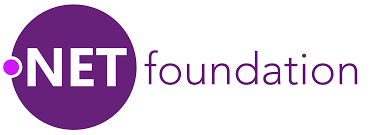
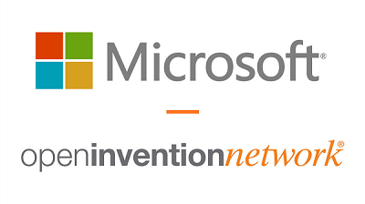

## Benefits of Open Source

Open Source es el término que se le asigna al software distribuido bajo una licencia que permite acceso al código fuente. Este tipo de licencia permiten el estudio y la modificación del software con total libertad. Además, su redistribución está permitida siempre y cuando respeten y mantengan los términos de licencia bajo la que se adquiere el software.

Hoy en día desde las principales empresas se posicionan por un modelo Open Source por las ventajas que ofrece.

- Calidad

    Según los proyectos de código abierto ganan usuarios, aumentan las personas que contribuyen a la mejora del software. Buscando y corrigiendo errores. Una mejora continua del proyecto.

- Seguridad y transparencia

    Al tener el código expuesto se expone el flujo completo de los datos y toda su lógica. Cualquier fallo de seguridad puede ser detectado por la comunidad y corregido. Un nivel de transparencia que genera mayor confianza por los usuarios.

- Colaboración

    El Open Source facilita la colaboración entre empresas que puedan ser competidoras entre sí. Lo que hace ganar tiempo y ahorrar dinero al estar trabajando sobre el mismo foco.

- Estándares

    Un proyecto Open Source exitoso puede establecer una manera común de realizar las cosas hacia al resto de la comunidad sin riesgos de agentes privados.

- Personalización

    La libertad completa de poder realizar soluciones a medida. Teniendo acceso al código puedes modificarlo, extenderlo creándote tu propia versión al gusto.

- Innovación

    La evolución de la tecnología exponiendo y compartiendo el trabajo es más difícil cuando el software es cerrado y privado. Hoy, gracias al Open Source la innovación en la nube, la movilidad, Big Data, Internet de las cosas, la web... es mayor gracias a que las principales empresas junto a Microsoft apuestan por este modelo. 

- Coste

    Todas las ventajas comentadas anteriormente afectan en beneficio del coste de un desarrollo de software: mayor calidad, seguridad, colaboración, innovación. La posibilidad de enfocar los recursos y mejorar las decisiones enfocando el resultado hacia un camino exitoso.

Microsoft lleva años haciendo cambios y abrazando el modelo Open Source. 
En 2014 se creó la .Net Foundation con el objetivo de defender la necesidad del ecosistema .NET y fomentar el desarrollo abierto y colaborativo. Desde su creación son ya más de 50 proyectos soportados. No solamente con apoyo desde Microsoft sino también patrocinadores como Red Hat, JetBrains, Google, Unity, Samsung forman parte de la misma, que junto con más de 60.000 usuarios contribuyen a mejorar cada día el futuro de .NET en proyectos como ASP.NET Core, ML.NET, Roslyn, Entity Framework entre otros donde por su puesto se encuentra .NetCore. También por primera vez las tres principales tecnologías desarrollo UX de Windows: WPF, Windows Forms y WinUI, son de código abierto, públicos y disponibles a través de sus repositorios GitHub que los puedes encontrar en https://github.com/dotnet.

 

Desde 2016 Microsoft pertenece a la Linux Foundation como miembro platino y uno de los mayores contribuidores de Linux. No es ningún secreto que en el pasado hubo fricciones con la comunidad del código abierto. Pero esos tiempos han quedado atrás y Microsoft hoy en día es una de las principales empresas que apoya y adapta el Open Source en todos sus proyectos. En octubre del 2018 anunció su incorporación a la Open Invention Network (“OIN”), una comunidad fundada en noviembre de 2005 con el objetivo de utilizar la cartera de patentes de forma libre entre sus miembros evitando riesgos. Con su inscripción a la OIN, Microsoft cede gratuitamente más de 60.000 licencias, lo que significa que todos los miembros son libres de hacer, usar o distribuir tecnología de sistemas Linux sin ningún tipo de canon impuesto.
Con este acto ratifica más la apuesta que ha dado Microsoft hacia el Open Source en beneficio de todos.

