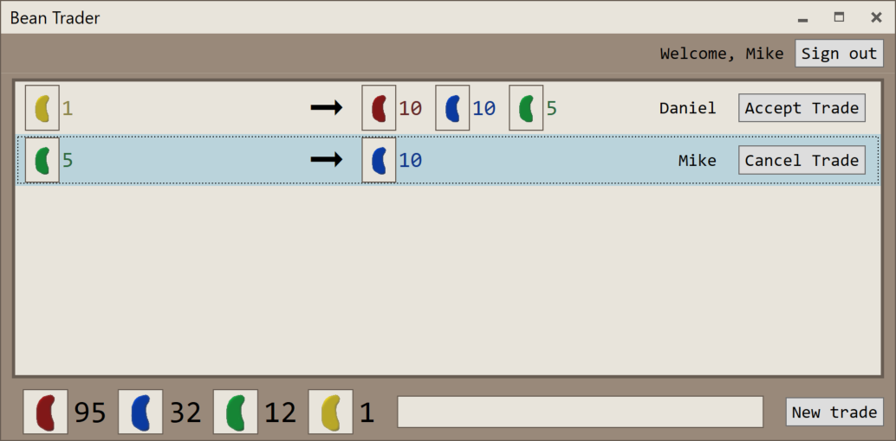

# Bean Trader Demo App

Bean Trader is a sample app used to demonstrate porting a .NET Framework WPF app to .NET Core 3.

The app is designed to be simple to port while using some interesting functionality, representative of real-world apps developers are likely to want to port to .NET Core.

The app makes use of:

* WCF client APIs
    * Including a NetTcp duplex binding and cert-secured transport security for communication with an Azure-hosted WCF service.
* [MahApps.Metro](https://mahapps.com/) APIs
    * Including custom dialogs and app theming
* Dependency injection with [Castle.Windsor](http://www.castleproject.org/projects/windsor/)
* Azure Key Vault SDK
* Settings retrieved from registry and ConfigurationManager APIs
* Resources and embedded resources (resx files, as well as images and icons)

## .NET Core 3 Migration

The [NetFx](./NetFx) directory contains the .NET Framework app in its original state. The [NetCore](./NetCore) branch contains the solution in its final state after porting the application to .NET Core (while also leaving the .NET Framework project working correctly).

A full writeup of the migration process is available in the [migration steps](MigrationSteps.md) doc and a [video walkthrough](https://youtu.be/5MomsgkWkVw) of the porting process is available on YouTube.

The general steps to port from .NET Framework to .NET Core include:

1. Prepare for migration.
    1. Use the [.NET Portability Analyzer](https://docs.microsoft.com/dotnet/standard/analyzers/portability-analyzer) to understand what .NET Framework APIs the project uses in order to understand where there may be porting challenges.
    1. Review library and NuGet dependencies which may introduce challenges if they do not support .NET Standard or .NET Core.
    1. Migrate the existing project file to reference NuGet packages with [`<PackageReference>`](https://docs.microsoft.com/nuget/consume-packages/package-references-in-project-files) syntax instead of using a packages.config file.
1. Migrate the project file.
    1. Create a new project file either:
        1. Replacing the current project file (which has the drawback of not working with the VS designer)
        1. Next to the existing project file (which has the drawback of needing to address shared output and intermediate output paths)
        1. In a separate directory from the existing project file (which has the drawback of needing to explicitly reference source, xaml, and resx files from the original directory and make sure they have proper paths within the new project using Link attributes)
    1. Update the new project file to have relevant elements from the old project file, such as resources, properties, and project/package references.
    1. Update NuGet package versions to versions supporting .NET Standard or .NET Core.
        1. In some cases, packages won't support .NET Core or .NET Standard and it will be necessary to find alternative packages or use existing .NET Framework-targeted packages and test that relevant code paths work as expected on .NET Core.
1. Fix source code to work on .NET Core.
    1. API-level differences between .NET Framework and .NET Core APIs will be needed.
    1. Generated code (such as [WCF clients](https://docs.microsoft.com/dotnet/core/additional-tools/wcf-web-service-reference-guide)) may need to be regenerated.
    1. If necessary, be sure that the original project continues to build despite source code changes.
1. Run and test.
    1. Beware of NotSupportedExceptions. [Analyzers](https://github.com/dotnet/platform-compat) exist to identify APIs that may fail.
    1. Look for any other differences that manifest at runtime (such as outdated app.config sections).

## Useful Links

* [Intro to .NET Core 3](https://docs.microsoft.com/en-us/dotnet/core/whats-new/dotnet-core-3-0)
* [.NET Core 3 Migration Guidance](https://github.com/dotnet/samples/tree/master/wpf)
* [.NET Portability Analyzer](https://docs.microsoft.com/dotnet/standard/analyzers/portability-analyzer)
* [Platform Compatibility Analyzers](https://github.com/dotnet/platform-compat)
* [Add WCF clients to .NET Core projects](https://docs.microsoft.com/dotnet/core/additional-tools/wcf-web-service-reference-guide)
* [Bean Trader Migration Video](https://youtu.be/5MomsgkWkVw)
